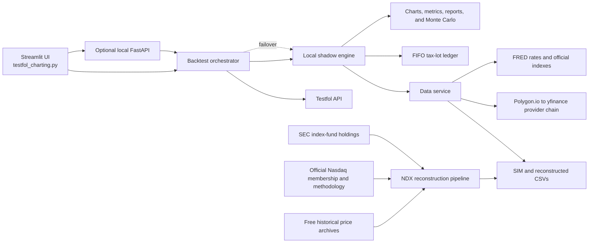

# Testfol Margin Stresser

[Open the live Streamlit app](https://testfol-marginstresser.streamlit.app/)

Testfol Margin Stresser is a portfolio research workbench for leveraged backtests, margin stress testing, tax-aware rebalancing, Nasdaq index reconstruction, and long-horizon risk analysis. It combines Testfol-compatible return conventions with a local daily engine so portfolios can still run when the remote API is unavailable.

> This project is for research and education. It is not investment, tax, accounting, or legal advice.

## Highlights

- **Hybrid execution:** use the Testfol API when available, with automatic failover to the local shadow engine.
- **Multi-provider prices:** Polygon.io when configured, then per-ticker yfinance fallback.
- **Leveraged ticker modeling:** daily-reset leverage, historical Fed Funds financing, implementation spreads, expenses, caps, and funding-reference overrides.
- **Margin stress testing:** fixed, variable, and tiered rates; Actual/360 interest; maintenance requirements; portfolio-margin comparisons; withdrawals; and margin calls.
- **Tax-aware simulation:** FIFO tax lots, proportional basis recovery, short- versus long-term gains, federal and state taxes, Section 1256 treatment, and collectibles treatment.
- **Nasdaq research:** reconstructed NDX, NDXMEGA, NDXMEGA2, and NDX30 histories; dynamic annual constituent strategies; and the QQUP realized-tracker simulation.
- **Analysis tools:** benchmark-relative metrics, drawdowns, rolling statistics, return heatmaps, rebalancing analysis, Monte Carlo paths, portfolio X-Ray, moving averages, and Weinstein stages.
- **Research utilities:** an asset-class periodic table and an NDX-100 scanner for 200-day SMA and 200-week WMA breaches.
- **Preset catalog:** 28 categorized portfolios spanning core NDXMEGA, diversified, leveraged, single-asset, and experimental strategies.

## Quick Start

```bash
git clone https://github.com/Acelogic/Testfol-MarginStresser.git
cd Testfol-MarginStresser

python -m venv .venv
source .venv/bin/activate
python -m pip install -r requirements.txt

streamlit run testfol_charting.py --server.port 8501
```

The Streamlit app will be available at `http://localhost:8501`.

To launch both the optional FastAPI backend and Streamlit frontend:

```bash
python run.py
```

This starts FastAPI on port `8100` and Streamlit on port `8501`.

### Optional Credentials

The local engine and yfinance fallback work without Testfol or Polygon credentials. Export only the services you want to use:

```bash
export POLYGON_API_KEY="..."
export TESTFOL_API_KEY="..."

# Alternatively, allow the app to obtain a Testfol session:
export TESTFOL_EMAIL="..."
export TESTFOL_PASSWORD="..."
```

| Variable | Purpose |
|---|---|
| `POLYGON_API_KEY` | Enables Polygon.io as the first standard-price provider. |
| `TESTFOL_API_KEY` | Supplies an existing Testfol bearer token. |
| `TESTFOL_EMAIL` / `TESTFOL_PASSWORD` | Optional Testfol sign-in credentials when no token is supplied. |
| `TESTFOL_DEBUG` | Enables additional local-engine diagnostic output. |
| `NDX_DATA_SOURCE` | Selects the NDX reconstruction provider (`yfinance`, `stooq`, or `polygon`). Prefer the rebuild CLI flags below. |

## Using the App

The primary entry point is [`testfol_charting.py`](testfol_charting.py). The sidebar exposes the Simulator, documentation, and changelog. Inside the simulator, strategy configuration is divided into five tabs:

| Tab | What it controls |
|---|---|
| **Portfolio** | One or more portfolios, allocations, presets, cash flows, comparisons, and rebalance rules. |
| **Margin & Financing** | Starting debt or cash, borrowing-rate model, withdrawals, maintenance requirements, and tax-payment funding. |
| **Asset Explorer** | Annual asset-class performance rankings and filters. |
| **NDX Scanner** | Current Nasdaq-100 moving-average scans, breach history, rankings, and quick loading into a portfolio. |
| **Settings** | Tax assumptions, chart behavior, portfolio margin, and advanced simulation options. |

Completed backtests expose these result views:

- Chart and margin/equity overlays
- Returns analysis and fresh-start calendar returns
- Rebalancing trades and composition
- Federal and state tax analysis
- Portfolio X-Ray
- Historical-bootstrap Monte Carlo
- Debug and provider logs
- Withdrawal history

Standalone HTML reports can be downloaded from the app after a run.

## Presets and Ticker Syntax

Presets live in [`data/presets.json`](data/presets.json) and are grouped into:

- Core NDXMEGA
- Classic & Diversified
- Leveraged Strategies
- Single Asset & Proxies
- Research & Experimental

The local engine understands Testfol-style query modifiers:

| Modifier | Meaning | Example |
|---|---|---|
| `?L=X` | Daily-reset leverage with financing on the additional exposure. | `SPY?L=2` |
| `?E=X` | Annual operating expense ratio in percent. | `QQQ?E=0.20` |
| `?D=X` | Legacy annual-drag alias. | `SPY?D=0.50` |
| `?UE=X` | Annualized underlying-return adjustment before leverage and caps. | `SPY?UE=1` |
| `?CU=X&CL=Y` | Upper and lower daily underlying-return caps. | `SPY?CU=2&CL=-2` |
| `?SW=X&SP=Y` | Swap-exposure and financing-spread overrides. | `SPY?L=2&SW=1&SP=0.50` |
| `?FR=X` | Funding reference such as `EFFRX`, `CASHX`, `TBILL`, or a FRED `DGS*` series. | `SPY?L=2&FR=DGS3MO` |

Dynamic Nasdaq tickers such as `NDX_TOP2_ANN`, `NDX_TOP8_ANN`, and `NDXMEGA_TOP8_ANN` select constituents using the membership and weights known at each rebalance. They support leverage, automatic per-company expense ratios, and equal-, cap-, or rank-based weighting. See the [User Guide](docs/user_guide.md#dynamic-nasdaq-rotation-tickers) for the complete syntax and bias controls.

### QQUPSIM Versus Theoretical NDXMEGA 2x

`QQUPSIM` is a realized-tracker series designed to approximate the traded QQUP product across its full history:

1. Reconstructed NDXMEGA **price-return** history before an official index series is available.
2. Official `NASDAQNDXMEGA` price-index returns after the first common anchor.
3. A Testfol-compatible daily 2x calculation using DFF financing, `SW=1.10`, `SP=0.40`, and one `E=0.95` deduction before fund inception.
4. Actual adjusted QQUP returns once the fund begins trading, without deducting its expense ratio a second time.

Use `NDXMEGASIM?L=2&E=0.95` when you intentionally want a theoretical leveraged **total-return** index instead. The two series are not interchangeable because applying an expense ratio cannot remove dividends already included in `NDXMEGASIM`.

## Architecture



### Key Modules

| Location | Responsibility |
|---|---|
| [`testfol_charting.py`](testfol_charting.py) | Main Streamlit entry point and API/in-process routing. |
| [`app/core/backtest_orchestrator.py`](app/core/backtest_orchestrator.py) | Chooses API or local execution and handles failover. |
| [`app/core/shadow_backtest.py`](app/core/shadow_backtest.py) | Daily local backtest, rebalancing, cash flows, leverage, and FIFO tax lots. |
| [`app/services/data_service.py`](app/services/data_service.py) | Resolves standard tickers, SIM aliases, official-index splices, and QQUPSIM. |
| [`app/services/price_providers.py`](app/services/price_providers.py) | Polygon.io and yfinance provider abstraction with per-ticker fallback. |
| [`app/services/testfol_api.py`](app/services/testfol_api.py) | Remote Testfol requests and USD margin simulation. |
| [`app/core/tax_library.py`](app/core/tax_library.py) | Federal and state tax calculations and historical tax data. |
| [`app/ui/results/`](app/ui/results/) | Result rendering, taxes, Monte Carlo, withdrawals, and debugging. |
| [`data/ndx_simulation/`](data/ndx_simulation/) | NDX holdings, membership, pricing, reconstruction, validation, and backtest scripts. |

The disk cache in [`app/common/cache.py`](app/common/cache.py) uses HMAC signing and versioned keys. Backtest results are invalidated when their inputs or local reconstruction files change.

## Modeling Notes

### Margin

USD margin is modeled as a separate liability ledger. Interest accrues for every elapsed calendar day on an Actual/360 basis and is posted to principal monthly:

```text
daily interest = settled loan × annual rate / 360
```

Variable-rate simulations use historical Fed Funds plus a configurable spread. Tiered mode applies blended borrowing tiers. Maintenance and portfolio-margin usage are evaluated separately from portfolio market value.

### Tax Lots

The shadow engine uses FIFO accounting. Every purchase creates a dated lot with quantity and basis. Partial sales recover the proportional basis of the shares sold, and only the realized gain is taxable. The tax layer distinguishes short- and long-term gains and includes special handling for Section 1256 contracts and long-term collectibles.

Historical tax simulation is an approximation, not tax-preparation software. The model cannot reproduce every taxpayer-specific election, deduction, carryforward, wash-sale adjustment, or change in law.

### Synthetic Leverage

Synthetic `?L` tickers reset leverage daily. Financing is charged separately from the explicit expense ratio using historical DFF when available and a documented fallback when it is not. This produces path dependence and volatility drag; it is not equivalent to multiplying cumulative returns by the leverage factor.

See [Methodology](docs/methodology.md) for the formulas and return conventions.

## Nasdaq Reconstruction

The NDX reconstruction pipeline combines:

- SEC EDGAR filings from historical Nasdaq-100 tracking funds
- Archived official Nasdaq membership snapshots
- Current Nasdaq component data
- Nasdaq index methodology rules
- Free WIKI, CMU, Stooq, and other historical-price archives for delisted securities
- Explicit mappings and identity checks for renamed, acquired, and recycled tickers

The reconstruction retains source manifests, dated holdings snapshots, price-coverage diagnostics, and benchmark validation instead of hiding unavailable securities behind silent substitutions.

### Generated Series

| File | Return convention | Primary use |
|---|---|---|
| `data/NDXMEGASIM.csv` | Dividend-adjusted total return | NDXMEGA 1.0 research and theoretical leveraged expressions. |
| `data/NDXMEGAPRICESIM.csv` | Raw-close price return | Historical underlying used to construct QQUPSIM. |
| `data/NDXMEGA2SIM.csv` | Dividend-adjusted total return | NDXMEGA 2.0 research. |
| `data/NDX30SIM.csv` | Dividend-adjusted total return | NDX30 research and QTOP extension. |

### Rebuilding Everything

Run the complete pipeline from the repository root:

```bash
python data/ndx_simulation/scripts/rebuild_all.py
```

The full rebuild downloads or reuses SEC data, maps historical identities, builds canonical holdings, merges free delisted-price history, reconstructs weights, generates both NDXMEGA return conventions, rebuilds NDXMEGA2 and NDX30, and runs validation. `NDXMEGAPRICESIM.csv` is rebuilt automatically, so QQUPSIM stays synchronized.

Useful options:

```bash
# Reuse already-downloaded SEC filings/components.
python data/ndx_simulation/scripts/rebuild_all.py --skip-download

# Refresh all free constituent, index-fund, membership, and price-history inputs.
python data/ndx_simulation/scripts/rebuild_all.py \
  --refresh-official-membership \
  --refresh-index-funds \
  --refresh-free-history

# Select a reconstruction price provider.
python data/ndx_simulation/scripts/rebuild_all.py --stooq
python data/ndx_simulation/scripts/rebuild_all.py --polygon "$POLYGON_API_KEY"
```

`--clear-cache` removes the locally generated NDX caches and simulation outputs before rebuilding. Use it only when a clean reconstruction is intentional.

Official methodology references stored with the project:

- [Nasdaq-100 methodology](data/ndx_simulation/docs/Methodology_NDX.pdf)
- [Nasdaq-100 Mega methodology](data/ndx_simulation/docs/NDXMEGA%20Methodology.pdf)
- [Nasdaq-100 Mega 2 methodology](data/ndx_simulation/docs/NDXMEGA2_Methodology.pdf)
- [Nasdaq-100 Top 30 methodology](data/ndx_simulation/docs/NDX30_Methodology.pdf)

## Testing

Run the complete test suite:

```bash
pytest -q
```

Useful focused suites while working on the reconstructed indexes and QQUPSIM:

```bash
pytest -q tests/test_ndx_rebuild_all.py \
  tests/test_ndxmega_financing_fixes.py \
  tests/test_ndx_holdings_pipeline.py \
  tests/test_ndx_free_historical_data.py
```

## Documentation

- [User Guide](docs/user_guide.md) — configuration, presets, ticker modifiers, and result views.
- [Methodology](docs/methodology.md) — data sources, leverage financing, margin, Monte Carlo, FIFO accounting, and tax methods.
- [FAQ and Troubleshooting](docs/faq.md) — common errors, local/API differences, limitations, and provider setup.
- The in-app **Docs** and **Changelog** destinations provide the same operational guidance alongside the simulator.

## Limitations

- Available start dates depend on the selected assets and provider coverage.
- Reconstructed and synthetic series are models, not actual tradable fund histories.
- Delisted-security coverage is strongest where free archival prices and SEC identity evidence overlap.
- Provider corrections, corporate actions, distributions, financing assumptions, and tracking error can change results.
- The local engine does not currently model short selling.
- Tax and margin rules are simplified research assumptions and must not be used as professional advice.

## License

This project is licensed under the [GNU General Public License](LICENSE).

## Disclaimer

**Educational use only.** Historical and simulated performance does not guarantee future results. Leveraged products and margin borrowing can produce losses greater than the initial capital committed. Review the methodology, source coverage, and assumptions before relying on any result.
